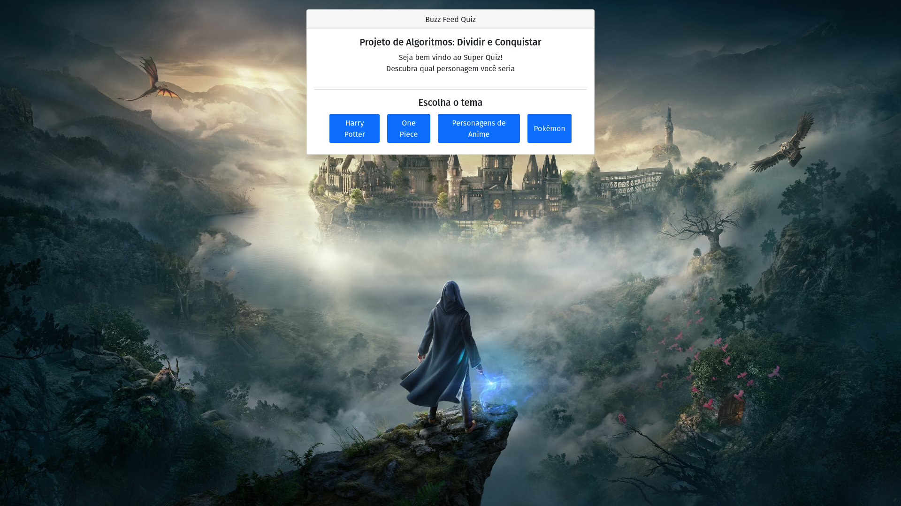
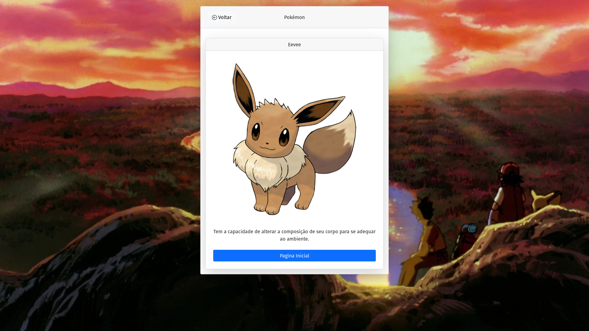

# BuzzFeedQuiz

**Número da Lista**: 20 
**Conteúdo da Disciplina**: D&C 

## Alunos
|Matrícula | Aluno |
| -- | -- |
| 19/0025379  |  Brenno Oliveira Silva |
| 19/0020377  |  Thiago Sampaio de Paiva |

## Sobre 
O BuzzFeedQuiz consiste na utilização do algoritmo de contagem de inversões para relacionar as respostas do jogador com as de algum personagem.

## Screenshots

## Apresentação
[Video da Apresentação](assets/videos/apresentacao.mp4)

## Instalação 
**Linguagem**: Javascript 
**Pré-requisitos**: Navegador Web

## Uso 
Para utilizar o projeto acesse: https://d-c-buzz-feed-quiz.vercel.app/ ou rode os comandos: 
`npm install`  
`npm run dev`